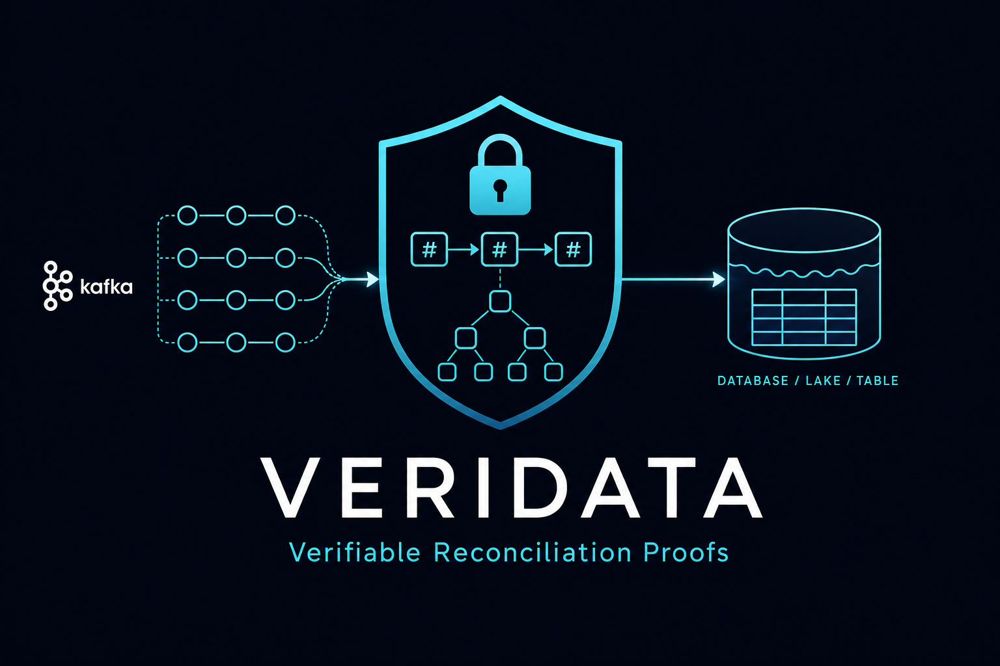

<p align="center">
  
</p>

# veridata

[](https://pypi.org/project/veridata-vrp/)
[](https://github.com/vaquarkhan/veridata/actions/workflows/ci.yml)
[](LICENSE)

**Author:** [Vaquar Khan](https://github.com/vaquarkhan)

**Verifiable Reconciliation Proofs (VRPs)** — signed, tamper-evident, independently verifiable receipts proving that, over a defined boundary, a data sink faithfully reflects a data source, with explicit detection of dropped, duplicated, and silently mutated records.

> The guarantee is **verifiable reconciliation** with dup/drop/mutation detection and third-party-verifiable proof over a boundary — not "exactly-once for everything."

**Adoption model:** enterprise depth (critical pipelines, auditors, regulators) — not consumer virality. See [Positioning](docs/POSITIONING.md) for an honest **what we ship vs what we do not claim** (cloud production, auto-remediation, DLQ/replay).

## Status

| Phase | Scope | Status |
|-------|-------|--------|
| **P0** | Spec + conformance vectors | Complete |
| **P1** | Deterministic core + offline verifier | Complete |
| **P2** | Kafka → Iceberg via SPI + E2E (demo backends) | Complete |
| **P3** | CLI, metrics, `--check`, demo | Complete |
| **P4** | Publishing + cloud connectors | Cloud connectors + KMS shipped; crates.io/releases pending |
| **P5** | Connector breadth + advanced features | Not started — [roadmap](docs/developer/ROADMAP.md) |

## Quick links

- [Positioning](docs/POSITIONING.md) — enterprise narrative; claims we do **not** make yet
- [Project status](docs/developer/PROJECT-STATUS.md) — verified vs CI-only vs outstanding
- [P4/P5 roadmap](docs/developer/ROADMAP.md) — cloud, KMS, SQL pushdown, publishing
- [Developer testing guide](docs/developer/TESTING.md) — run tests, 100% coverage, tutorials
- [Coverage checklist](docs/developer/COVERAGE-CHECKLIST.md) — per-module 100% line targets
- [VRP v0.1 specification](docs/spec/VRP-v0.1.md) — normative proof format and verify algorithm
- [Conformance vectors](conformance/) — canonical test proofs with expected outcomes
- [Python package (PyPI)](python/README.md) — `pip install veridata-vrp` offline verifier
- [Contributing](CONTRIBUTING.md)

## What a VRP proves

Given a **boundary** (offset range, time window, or batch id), a VRP commits to:

1. **Source commitment** — count + Merkle root of source fingerprints
2. **Sink commitment** — count + Merkle root of sink fingerprints
3. **Reconciliation evidence** — matched multiset, missing (drops), duplicated, mutated records
4. **Policy verdict** — PASS, FAIL, or UNVERIFIED (never silent pass)
5. **Signature** — Ed25519 over canonical document bytes

Proofs contain **only salted hashes** — never raw field values or identities.

## What we do not ship (v0.1)

- Automated **remediation**, **DLQ routing**, or **idempotent replay** (detect + prove only)
- Production **cloud** connectors — build with `--features cloud`; see [cloud examples](docs/connectors/CLOUD-EXAMPLES.md)
- Inline “zero-trust” gate in your pipeline — you call reconcile/verify; we provide the proof and verifier

## Quick start (Python — PyPI)

> **Note:** PyPI name is `veridata-vrp`, not `veridata`. The name [`veridata` on PyPI](https://pypi.org/project/VeriData/) is an unrelated pandas data-cleaning library.

```bash
pip install veridata-vrp
veridata-vrp-verify conformance/valid.vrp.json --pubkey conformance/test-key.pub.b64
```

```python
import json
from veridata_vrp import verify_vrp

vrp = json.load(open("proof.vrp.json", encoding="utf-8"))
result = verify_vrp(vrp, pubkey_b64="...")
print(result.outcome)  # PASS | FAIL | UNVERIFIED
```

See [python/README.md](python/README.md) for development and publishing.

## Quick start (CLI)

```bash
cargo build -p veridata-cli
cargo run -p veridata-cli -- init
cargo run -p veridata-cli -- reconcile --demo
cargo run -p veridata-cli -- verify
cargo run -p veridata-cli -- report
```

Or run the full demo: `powershell -File scripts/demo.ps1`

## Verify offline (library / conformance)

```bash
cargo test -p veridata-proof --test p1_gates
python conformance/validate_p0.py
```

## License

Apache-2.0 — see [LICENSE](LICENSE).
